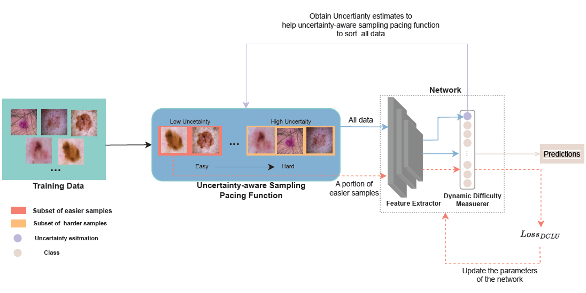

# DCLU---Demo
Chaoyi Li, Meng Li, Can Peng, Brian C. Lovell, "Dynamic Curriculum Learning via In-Domain Uncertainty for Medical Image Classification", MICCAI 2023 [[paper]](https://link.springer.com/chapter/10.1007/978-3-031-43904-9_72)



In this repository, we provide the demo of DCLU to reproduce the experiments on CIFAR10 in the supplementary material.

## Requirements
```
pip install -r requirements.txt
```

## Results
### CIFAR 10
|**Method**|**Accuracy**|
|----------|------------|
|Vanilla|$78.09(± 0.083)$|


|**Method**|Vanilla|
|----------|------------|
|**Accuracy**|$78.09(± 0.083)$|
